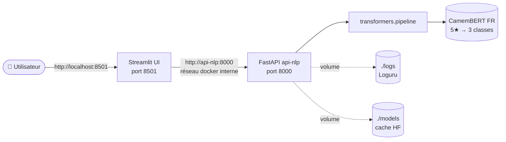

## 1. Objectif de cette application

Cette application vise à fournir une API de traitement automatique des avis en français pour une chaine hotelière, pour classifier ces avis en 3 catégories : positifs, neutre, négatif bas sur un modèle déjà entrainé.

## 2. Architecture

L'architecture est composée de deux modules principaux :

- **Backend : `api-nlp`** — Fournit une API REST pour l'analyse de texte basé sur le modèle.
- **Frontend : `ui-streamlit`** — Application web basée sur Streamlit pour interagir avec l'API et visualiser les résultats. C'est un outil simple de démonstration.

L'ensemble est conteneurisé avec Docker et orchestré via Docker Compose pour faciliter le déploiement et l'exécution multi-services.



## 3. Choix du modèle

Le modèle utilisé est cmarkea/distilcamembert-base-sentiment **DistilCamemBERT** (français), avec 68 millions de paramètres (~270 Mo). Ce modèle est optimisé pour la classification de sentiments sur des textes en français.

Il a été entrainé sur 2 type de dataset : les avis d'Amazon et les avis d'Allociné. Autrement dit, il a été entrainé sur des avis courts et sur des avis longs.

Il propose une prédiction en 5 classes : 1 star, 2 star, 3 star, 4 star et 5 star.

Source :  https://huggingface.co/cmarkea/distilcamembert-base-sentiment

## 4. Choix du seuil de mapping

Le seuil de mapping permet de définir la probabilité pour qu'une prédiction soit considérée comme positive, neutre ou négative. 

Dans un premier temps, nous avons considéré que la somme des scores de star 1 et star 2 représentent un avis négatif, que le score de star 3 représente un avis neutre et que la somme de star 4 et star 5 représentent un avis positif.

Cependant, cela a amené à des résultats erronés (5/30 tests paramétrés en échec) car la somme des étoiles 1 et 2 pouvait etre supérieur au score neutre qui était la cible (dans cet exemple, on obtenait négatif au lieu de neutre: "Chambre superbe avec vue sur le port mais petit-déjeuner décevant et service très lent.")

L'algorithme a donc été repris pour ne pas faire de somme mais utiliser directement l'inférence fournie par le modèle pour déterminer le sentiment. Là encore, certains résultats étaient erronés (6/30 tests paramétrés). 

Dans cet exemple on obtient négatif : "Séjour neutre, sans plus. Le personnel fait son travail, l'hôtel sa fonction. Rien de mémorable.", alors qu'on s'attend à obtenir neutre. On constate que le modèle a des prédictiosn assez proches : 
* "1 star": 0.04772130027413368
* "2 stars": 0.4886065423488617
* "3 stars": 0.4522453546524048

Dans cet exemple, le modèle obtiens positifs alors qu'il aurait du obtenir négatif car il ne sait pas interpréter l'ironie :
"On a passé un séjour qu'on n'oubliera pas. La climatisation en panne en plein août, sympa."
* "1 star": 0.0017168408958241343,
* "2 stars": 0.0066152154467999935,
* "3 stars": 0.08835633099079132,
* "4 stars": 0.5082714557647705,
* "5 stars": 0.3950401544570923


## 5. Endpoints fournis

L'API expose les endpoints suivants :

- `GET /health` : Vérification de l'état de santé de l'API.
- `POST /predict` : Prédiction du sentiment à partir d'un texte fourni.

## 6. Configuration

- **Variables d'environnement** :
    - `MODEL_PATH` : chemin vers le modèle à charger.
    - `LOG_LEVEL` : niveau de log (INFO, DEBUG, etc.).
- **Fichier d'environnement docker** :
    - cp .env.example .env : copie du sample .env.example vers .env pour le customizer
- **Logs** : Les logs sont stockés dans le dossier `logs/` et suivent le niveau défini par la variable d'environnement.

## 7. Lancement avec Docker et exécution des tests

### Lancement des services

```bash
docker compose up --build
```

Les services backend et frontend seront accessibles sur les ports définis dans le fichier `docker-compose.yml`.

### Arret des services

```bash
docker compose down
```

### Exécution des tests

Pour lancer les tests unitaires :

```bash
docker compose exec api-nlp pytest
```
